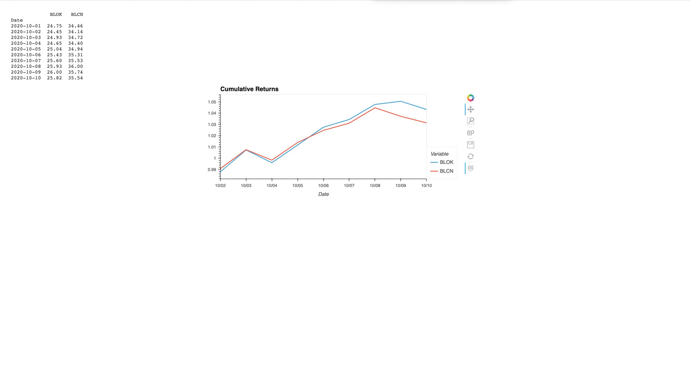

# analysis-of-the-ETF

# the analysis is a done on python notebook and along with application of Mysql quires and Hvplot visulization .  
# the anslysis includes the PYPL stock only  dialy retrun and the four assets' dialy return , annulized return and cumulative return of PYPL GDOT, GS and SQ .
